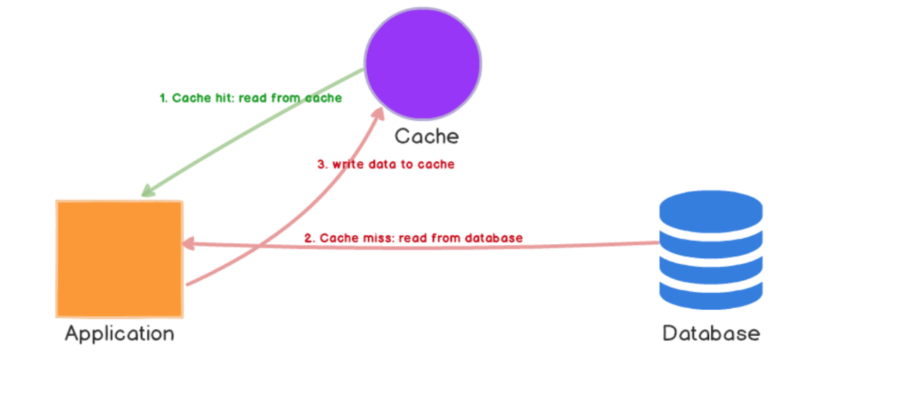
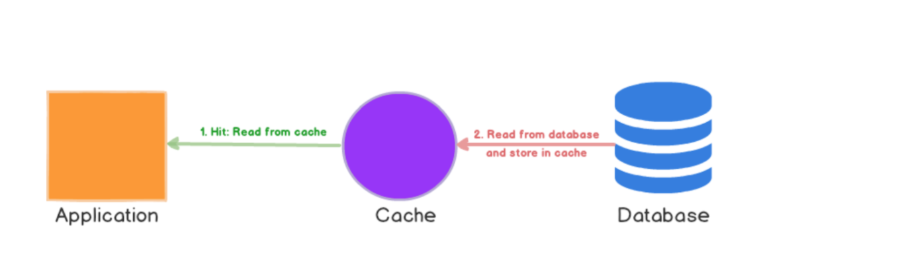

# Database Level Caching

## Introduction 

Caching is the process of storing data in the cache. The cache is a temporary storage area relatively small in size with faster access time. Whenever your application has to read data it should first try to retrieve the data from the cache. Only if it’s not found in the cache then it should try to get the data from the data store. Caching improves latency and can reduce the load on your servers and databases.
We can call it as a buffering technique that stores frequently-queried data in a temporary memory. 

## Issue

* Selecting the appropriate caching strategy as per different usecase/requirement.

* Defining a generic caching implementation architecture irrespective of technology or framework.

## Discussion

A caching strategy is to determine the relationship between data source and your caching system, and how data can be accessed. There are various strategies to implement cache but each will have different impacts on system design and the resulted performance. 
Below we will analyse some of the most adopted ones.
* Caching Strategies

    1. Cache Aside
        
    2. Cache Aside With Write Strategy

    3. Read-through

    4. Refresh Ahead

    5. Write-through

    6. Write-back

* How to choose the appropriate caching strategy ?

    1. Consistency:
        - Can the system tolerate slight inconsistency of data between cache and db upto certain time
    2. System Request Flow
        - Read Heavy System
        - Write Heavy System
    3. Implementation complexity
    

### Caching Strategies

#### 1. Cache Aside

    

* Pros:
    1. Cache-aside caches are usually general purpose and work best for read-heavy workloads.
    2. Systems using cache-aside are resilient to cache failures. If the cache cluster goes down, the system can still operate by going directly to the database.
    3. Another benefit is that the data model in cache can be different than the data model in database. E.g. the response generated as a result of multiple        queries can be stored against some request id
* Cons:
    1. When cache-aside is used, the most common write strategy is to write data to the database directly. When this happens, cache may become inconsistent         with the database. To deal with this, developers generally use time to live (TTL) and continue serving stale data until TTL expires. 

For improving data freshness appropriate write strategy should be used with Cache Aside Pattern

#### 2. Cache Aside With Write Strategy

* Pros:
Refresh-ahead reduces latency compared to read-through
* Cons:
It has an extra overhead as all updates/inserts needs to be sent to cache

#### 3. Read-through

    

Pros:
* In cache-aside, the application is responsible for fetching data from the database and populating the cache. In read-through, this logic is usually supported by the library or stand-alone cache provider.
* Read-through caches work best for read-heavy workloads when the same data is requested many times
* It does not load or hold all the data together, it’s on demand. Suitable for cases when you know that your application might not need to cache all data from data source in a particular category.
* If there are multiple such cache nodes & a node fails, it does not harm the application although in such situation, the application faces increased latency. As new cache node comes up online, more & more request flows through it & it keeps populating required data with every cache miss.
 

Cons:
* Unlike cache-aside, the data model in read-through cache cannot be different than that of the database.
* For cache miss, there are 3 network round trips. Check in the cache, retrieve from database, pour the data into the cache. So cache causes noticeable delay in the response.
* Stale data might become an issue. If data changes in the database & the cache key is not expired yet, it will throw stale data to the application. Developers deal with this by ‘warming’ or ‘pre-heating’ the cache by issuing queries manually.

#### 4. Refresh Ahead:

    

It’s a technique in which the cached data is refreshed before it gets expired.
refresh ahead caching does is it essentially refreshes the cache at a configured interval just before the next possible cache access although it might take some time due to network latency to refresh the data & meanwhile few thousand read operation already might have happened in a very highly read heavy system in just a duration of few milliseconds.

* Pros:
1. It’s useful when large number of users are using the same cache keys. Since the data is refreshed periodically & frequently, staleness of data is not a permanent problem.
2. Reduced latency than other technique like Read Through cache.
* Cons:
1. Probably a little hard to implement since cache service takes extra pressure to refresh all the keys as and when they are accessed. But in a read heavy environment, it’s worth it.

#### 5.Write-through

    

On its own, write-through caches don’t seem to do much, in fact, they introduce extra write latency because data is written to the cache first and then to the main database.
Write through cache’s should be  paired with read-through caches,so that we get all the benefits of read-through and we also get data consistency guarantee, freeing us from using cache invalidation techniques.

* Pros:
1. No stale data. It addresses the staleness issue of Read Through cache.
2. Suitable for read heavy systems which can’t much tolerate staleness.
* Cons:
1. It’s a write penalty system. Every write operation does 2 network operations — write data to data source, then write to cache.
Cache churn: If most of the data is never read, cache will unnecessarily host useless data. This can be controlled by using TTL or expiry.
2. In order to maintain the consistency between cache & data source, while writing a data, if any of your cache node goes missing, the write operation fails altogether.

#### 6. Write-Back

    

Write back caches improve the write performance and are good for write-heavy workloads. When combined with read-through, it works good for mixed workloads, where the most recently updated and accessed data is always available in cache.

* Pros:
1. It’s resilient to database failures and can tolerate some database downtime. 
2. If batching or coalescing is supported, it can reduce overall writes to the database, which decreases the load .
3. Since the application writes only to the caching service, it does not need to wait till data is written to the underlying data source. Read and write both happens at the caching side. Thus it improves performance.
4. Suitable for high read & write throughput system.
 
* Cons:
1. The main disadvantage is that if there’s a cache failure, the data may be permanently lost.
Eventual consistency between database & caching system. So any direct operation on database or joining operation may use stale data.

* Application design constraints with write-behind strategy:
1. Since in this strategy cache is written first & then database — they are not written in a transaction, if cached items can not be written to the database, some rollback process must be in-place to maintain consistency over a time window.
2. Write-behind caching may allow out of order database updates, so database have to be able to relax foreign key constraints. Also if the database is a shared database, other apps may also use it, hence no way to know whether write-behind cache updates will conflict with other external updates. This has to be handled manually or heuristically.

## Decision

* Cache Aside : Cache-aside caches are usually general purpose and work best for read-heavy workloads.
* Read Through: Read-through caches work best for read-heavy workloads when the same data is requested many times 
* Write-through : Suitable for read heavy systems which can’t much tolerate staleness. 
* Write-back : Good for write heavy workloads

## Implementation Components:

* Cache Layer:
    Caching should be added in persistence or adaptor layer (where database transactions are handled)
* Cache Manager:
    Contains cache initialization and configuration
* Cache Datastore:   
    Cache datastore can be key/value or grid structure depending on the implemented cache technology

## Argument

## Refrences

