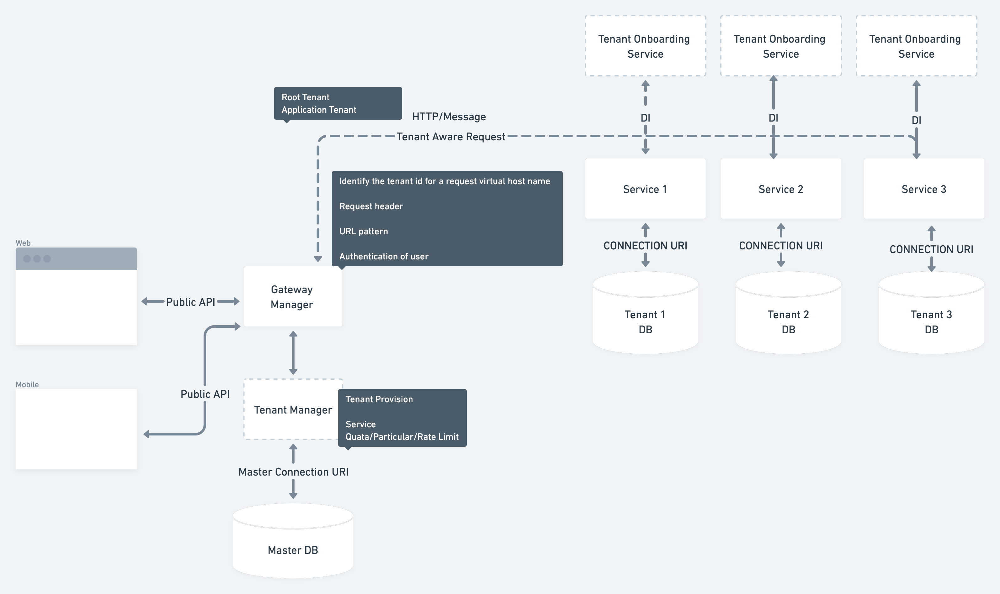
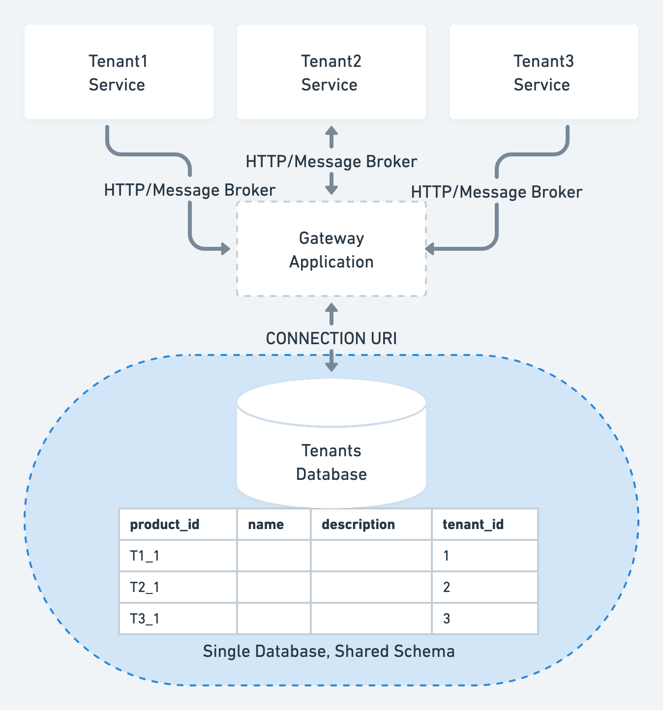
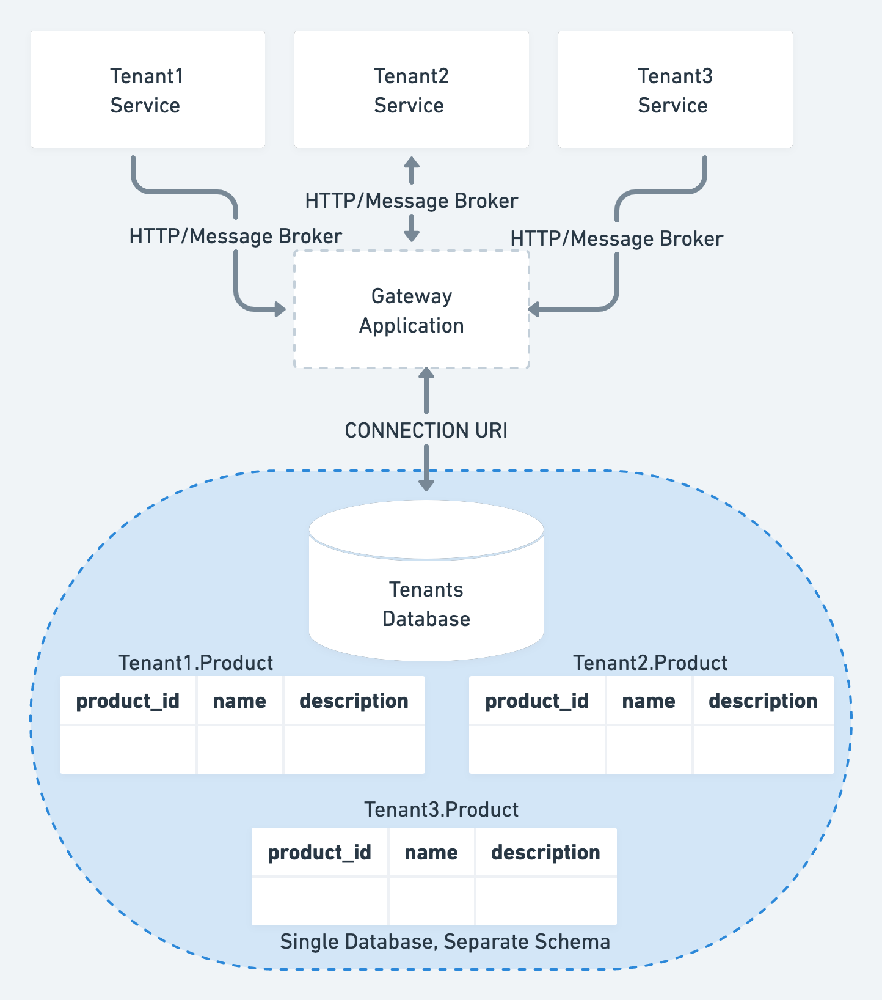
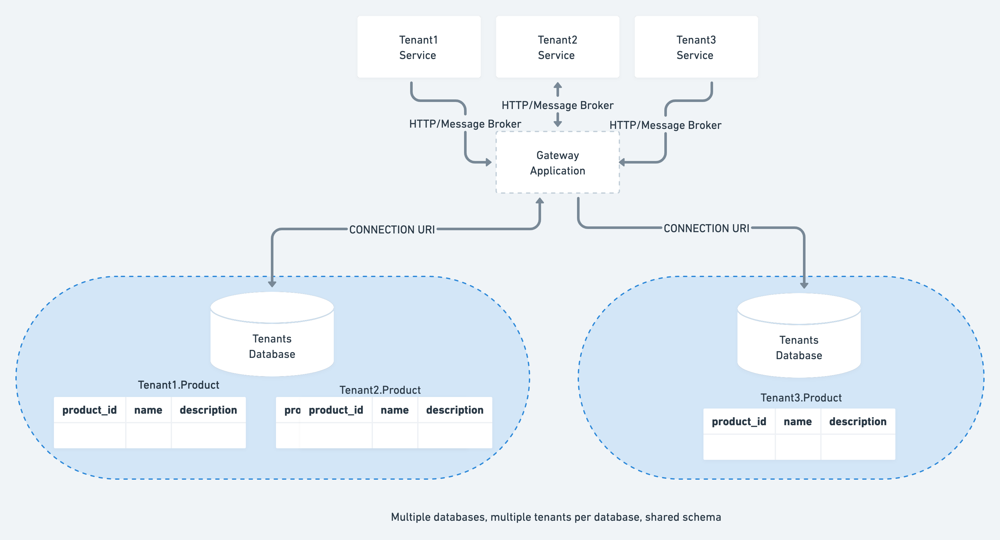
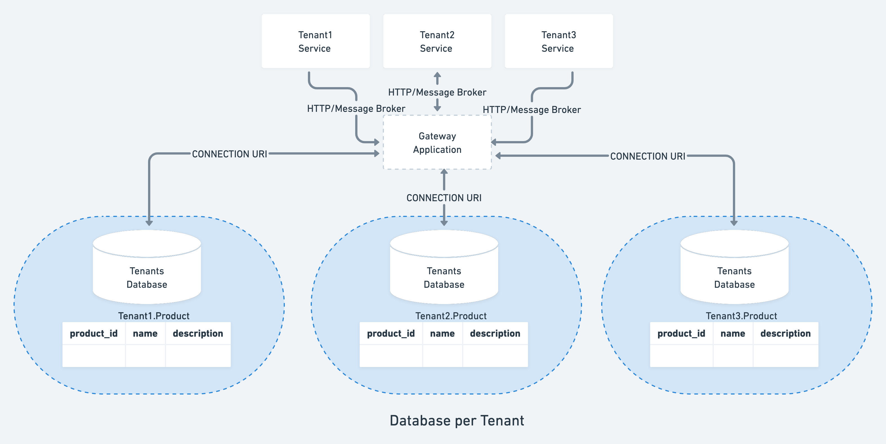
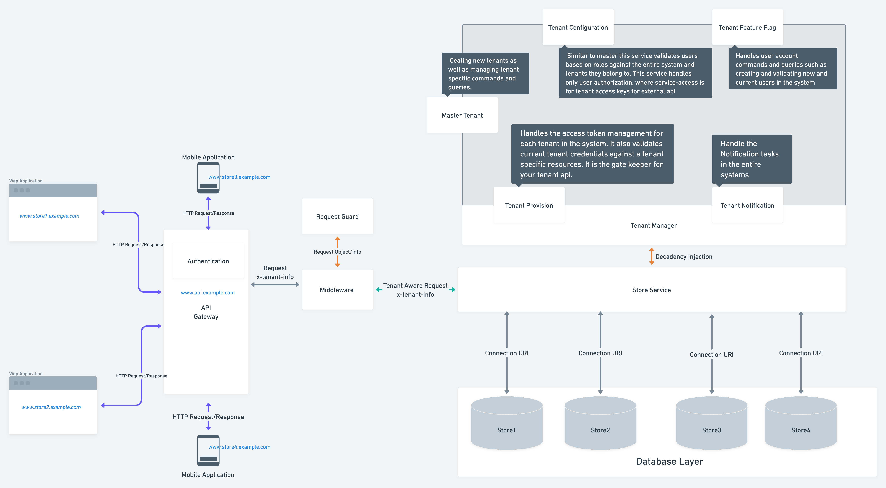
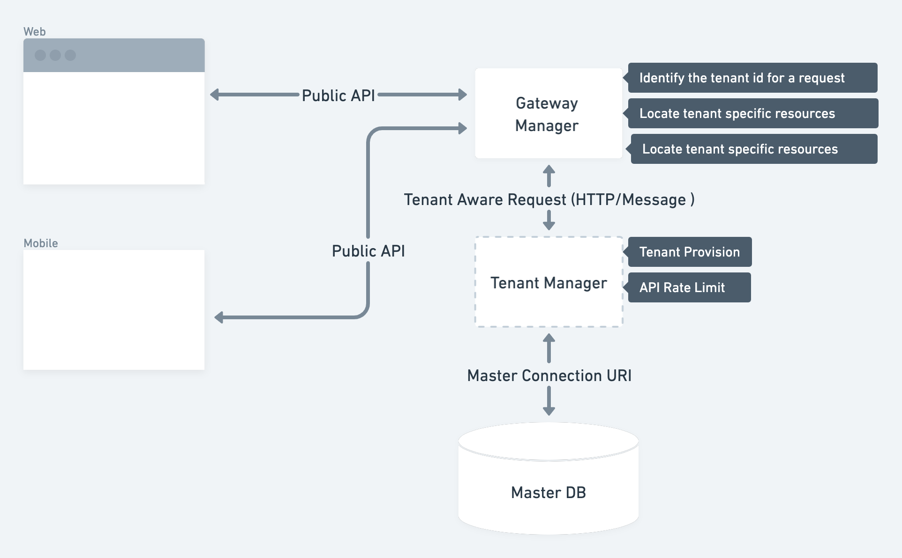

# Multitenancy

## Introduction 

Multitenancy is a software architecture where a single software instance can serve multiple, distinct user groups. 

Multitenant applications typically include a level of customization for tenants, such as customizing the look and feel of the application or allowing the tenant to decide on specific access control permissions and restrictions for users.

## Issue

* We need to connect any database based on a subdomain and change the database connection 	based on a subdomain.

* Thus, one instance of the SaaS can serve multiple customers/app without any interference of 	their individual data.

* Also needed to consider the scenario for SQL & NoSQL database.

  1. Security
  2. Client data isolation
  3. Database scalability
  4. Database management (backup and restoration)
  5. Operational complexities such as schema and tenant management
  6. Speed/Performance

## Discussion

* There are two models of architecting a multi-tenant system

    1. Instance replication
        - In the instance replication model, the system spins a new instance for every tenant.
    2. Data segregation
        - In the data-segregation model, the application is shared between tenants but the data of each tenant is stored in separate data stores.

* How to choose the appropriate tenancy model ?

    1. Scalability
        - Number of tenants
        - Storage per-tenant
        - Storage in aggregate
        - Workload
    2. Tenant isolation
        - Data isolation and performance (whether one tenant's workload impacts others)
    3. Per-tenant cost
        - Database costs
    4. Development complexity
        - Changes to schema
        - Changes to queries (required by the pattern)
    5. Operational complexity
        - Monitoring and managing performance
        - chema management
        - Restoring a tenant
        - Disaster recovery
    6. Customizability
        - Ease of supporting schema customizations that are either tenant-specific or tenant class-specific.

## Group/Options

- Data segregation

    1. SQL Database (Example - MySQL)

        - Single Database: All tenants are stored in a single database.
        - Database per Tenant: Every tenant has a separate, dedicated database to store the data related to that tenant.
        - Hybrid: Some tenants share a single databases while some tenants may have their own databases.

    2. NoSQL Database (Example - Mongo Db)

        - One database for all customers - Put all customer database in a single database with a single set of collections. Each document needs a customer_id field.
        - One database per customer - Route account data to the appropriate replica set and database name based on the customer.
        - One collection per customer - Separate collection for customer and segregate via customer name as a prefix. MongoDB is not meant to scale at the collection level and we will quickly run into namespace limits.

### Database Access Strategies

1. Single Database, Shared Schema/Pool model

    - One database to hold the data for all tenants
    - Every tenant's data is stored in the same set of tables
    - Tables that contain tenant-specific data include a column to identify which tenant each row belongs to

2. Single database, separate schema/Bridge model

    - One database to hold the data for all tenants
    - Separate tables for each tenant, each set under a tenant-specific schema

3. Multiple databases, multiple tenants per database, shared schema/Hybrid Model

    - Tenants share a database and schema with other tenants, but are spread over multiple databases

4. Database per Tenant/Silo model

- Every tenant has a separate, dedicated database to store the data related to that tenant.
- Example
    - `[tenant1].[Products]`
    - `[tenant2].[Products]`
    - `[tenant3].[Products]`
- If schema-based isolation is not good enough (or not supported by the target database), or if we don't want tenants to share the same database connection pool, then we can wire our application to use a different DataSource for each tenant.
- This approach unlocks new option for tenant isolation, for example it's possible to use different database & credentials for each tenant

## Decision

The fourth option(Database per Tenant/Silo model) is to store data for each tenant in separate databases within a cluster. We need our data isolated from other tenants, we can use the silo model and each database may have distinct data models, monitoring, management, and security footprints.

## Details

* Advantages of multi-tenant architecture

- Software multi-tenancy optimizes resource utilization, but offers flexibility of customization
- Efficient resource distribution
    - Businesses don’t have to waste budget on development, delivery, and support. And, as such, they won’t need to upgrade the hardware and network capacity as they grow.
- Maintenance-free
    - The service vendor takes care of the maintenance, allowing companies to save money and focus on other business goals.
- Third-party integration
    - It’s true that a single-tenant design allows for more customization. Nonetheless, multi-tenant SaaS apps with advanced APIs can easily integrate with other third-party software.
- Fast scaling
    - Most SaaS apps are subscription-based, but every vendor offers different pricing models. Smaller teams can pay a standard monthly payment to access the service. Larger enterprises, on the other hand, can benefit from the per-user model (where they pay only for active users). This allows companies to quickly adjust the expenses based on their needs.

## Assumptions

* We are accessing our Public REST API from different client like mobile or web

* Tenant management module (which comes pre-installed with the startup projects) allows you to set a connection string for any tenant (as optional), so you can achieve any of the approaches.

## Constraints

* Gateway Manager

    - The gateway manager works as the front facing proxy for the tenant apps. It is available as the mtg command on the command line.
    - Gateway must be started before the tenant apps can be accessed.
    - Identify the tenant id for a request
        - Identify the tenant id for a request virtual host name
        - Request Header
        - URL pattern
        - Authentication of user
    - Locate tenant specific resources, such as data sources for databases and services
    - Bind tenant specific resources to the request context
    - Core Components
        - Authentication
        - Proxy

* Middleware

    - Parse & Bind Tenant specific request context
    - Core Components
        - Request Guard
            - Bind the request header to each from all services

* Tenant Manager

- The tenant manager is used for managing tenants and their models.
- Switching the Database multi-tenancy using Database Access Strategies
- Core Components
    - Supper tenant (as master)
    - Tenant provision
    - Tenant configuration
    - Feature Flag
    - Localization (may be, mostly it goes with user context)

## Argument

| Measurement  | Single database, shared schema   | Single database, separate schema   | Database per Tenant   |
| ------------------------- | ------------------------- | ------------------------- | ------------------------------------------------------------------------------------------------- |
| Security | 👎 Risk of exposing one tenant's data to another tenant   👎 No tenant isolation  |  👎 Tenant data has some more isolation  👎 Still limited data isolation   | 👍Highest level of tenant isolation, supporting options for shared server and/or isolated servers  👎 Potentially more servers to patch and keep secure |
| Maintainability  | 👍 One database schema to maintain and a simple schema   👍 Adding new tenants is easy   👎 Can't easily restore a single tenant's data  |👍 One database to manage High Availability/Disaster Recovery/maintenance operation/monitoring strategy  👍 Extra scope and control over some tenant-specific maintenance activities   👎 Query complexity   👎 Lot of database objects being created to manage and maintain| 👍 Maintenance jobs can be managed and customized per tenant  👍 Can easily restore/relocate/clear down a tenant's data   👍 No added query complexity   👍 Adding new tenants is more involved, as new schemas need to be created   👎 As the number of tenants grows, there will be more databases being created to manage and maintain   👎 Some added complexity to maintain a registry of tenant-db mappings/application code to determine which connection to use   |
| Scalability   | 👎 Limited to scaling-up hardware, rather than scaling out   👎 Risk of "noisy neighbors"  |  👍 Data is partitioned into smaller tables, with smaller indexes   👍 Optimizations could be made at an individual tenant's schema level   👎 Limited to scaling-up hardware, rather than scaling out   👎 Risk of "noisy neighbors"   | 👍 Scale-out and scale-up are both options—tenants can be spread over multiple servers  👍 Choose to balance between cost (higher tenant density/fewer servers) and performance (lower tenant density/more servers)   👍 Control over "noisy neighbor" risks |
| Development Complexity    | Low |  Medium  | Low  |

## Refrences

- [Microsoft - Multi-tenant SaaS database tenancy patterns](https://docs.microsoft.com/en-us/azure/azure-sql/database/saas-tenancy-app-design-patterns)
- [Multi‐Tenant Data Architecture](https://ramblingsofraju.com/wp-content/uploads/2016/08/Multi-Tenant-Data-Architecture.pdf)
- [Implementing multi-tenant patterns in Amazon Redshift using data sharing](https://aws.amazon.com/blogs/big-data/implementing-multi-tenant-patterns-in-amazon-redshift-using-data-sharing/)
- [What is multitenancy?](https://www.redhat.com/en/topics/cloud-computing/what-is-multitenancy)
- [Multi tenant Architecture for a SaaS Application on AWS](https://www.clickittech.com/saas/multi-tenant-architecture/)
- [The Force.com Multitenant Architecture](http://www.developerforce.com/media/ForcedotcomBookLibrary/Force.com_Multitenancy_WP_101508.pdf)
- [Multi-Tenant Architecture: Designing a SaaS Application](https://relevant.software/blog/multi-tenant-architecture/)